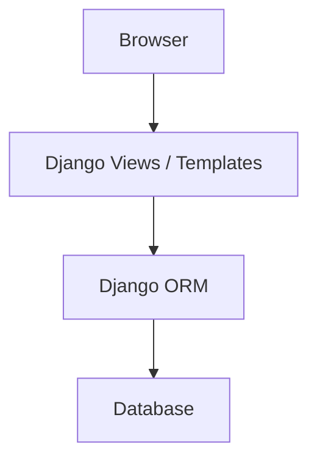

# Use Django when:

You are building a complete website or large business application.

## Example:

“For an e-commerce website with users, products, orders, payments, admin dashboard, and authentication, I would choose Django because it provides ORM, admin panel, authentication, and security features out of the box.”

## Simple design:

## Example use cases:

* E-commerce website
* College management system
* Blog with admin panel
* CRM system
* Internal company dashboard
