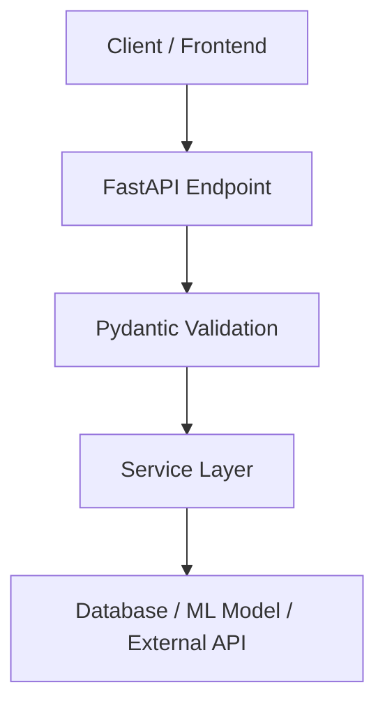

# Use FastAPI when:

You are building high-performance APIs, especially with async tasks.

## Example:

“For a machine learning prediction API or microservice, choose FastAPI because it supports async, automatic validation using Pydantic, and generates Swagger documentation automatically.”

## Simple design:

## Example use cases:

* ML model API
* Microservices
* Real-time APIs
* Backend for mobile apps
