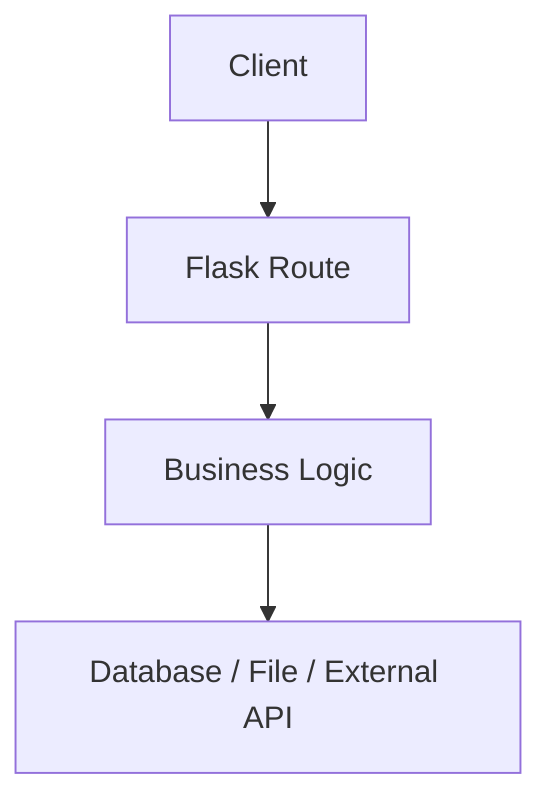

# Use Flask when:

You want a simple, flexible app with minimal setup.

## Example:

“For a small URL shortener or a simple internal API, I would choose Flask because it is lightweight and gives me full control over project structure.”

## Simple design:

## Example use cases:

* Small REST API
* Prototype
* Internal tool
* Simple webhook receiver
* Basic dashboard
